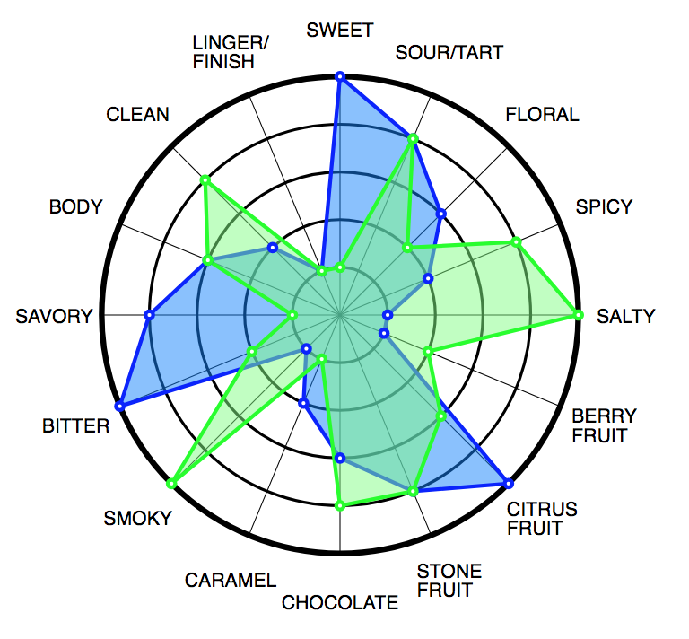

# Flavor Wheel



## What and why

I like coffee a lot, and I found this cute book once, [_33 Cups of
Coffee_](https://www.33books.com/products/33-coffees), that I thought was
perfect for writing down notes on the different coffees that I try.

This project is a web version of the flavor wheels found in the journal and
the [other journals](https://www.33books.com/collections/books) 33 Books
sells. I made this to get better at understanding SVGs and D3 and the huge
ecosystem that is modern browser development.

Nothing really beats writing on the physical book itself, so if you like
this, I recommend getting buying one of 33 Books. (By the way, I have no
relationship of any sort with the publisher; just a happy customer.)

## Usage

`yarn add flavor-wheel` (or `npm install --save flavor-wheel`)

Given that this is a frontend library, I recommend developing against this
library with a tool like Webpack. For an example of how you might set up
Webpack, see the example/ directory. Note that you won't need the
babel-loader configuration defined in webpack.config.json unless you plan to
develop with Babel.

The rest of this section roughly follows the Webpack + webpack-dev-server +
Babel setup that you can find in the example.

Create a basic HTML file:

```html
<!DOCTYPE html>
<html lang="">
  <head>
    <meta charset="utf-8">
    <meta http-equiv="x-ua-compatible" content="ie=edge">
    <title>Tasting wheel</title>
    <meta name="viewport" content="width=device-width, initial-scale=1">
    <!-- If you don't have a prepared CSS file, you can use the SCSS in the
    example under example/css. -->
    <link rel="stylesheet" href="/dist/bundle.css">
    <script src='/dist/bundle.js'></script>
  </head>
  <body>
    <svg id='wheel'></svg>
  </body>
</html>
```

Add this to your JavaScript:

```js
import FlavorWheel from 'flavor-wheel';
// Alternatively, without Babel's ES6 transpilation:
// const FlavorWheel = require('flavor-wheel').default;

const wheel = FlavorWheel.initialize("#wheel", {
  maxRating: 5,
  gridRadius: 250,
  viewWidth: 800,
  labels: ['smoky', 'berry\nfruit', 'bitter', 'sweet', 'sour', 'floral']
});

const data = [
  { label: 'smoky', value: 2 },
  { label: 'berry\nfruit', value: 3 },
  { label: 'bitter', valuej 4 },
  { label: 'sweet', value: 2 },
  { label: 'sour', value: 1 },
  { label: 'floral', value: 5 }
];
wheel.addData(data, '1');
```

A fully working example can be found in example/. See instructions in the
next section for running the development server.

Full documentation on how to create a FlavorWheel can be found in
src/flavor-wheel.js.

## Development setup

Prerequisites: Node >= 6

1. Clone this repository.
2. `yarn install` (or `npm install`)
3. `npm start`
4. Point your browser to http://localhost:8080/

This setup runs via webpack-dev-server, so any changes you make to the
JavaScript (library or example code) or SCSS example assets will trigger a
browser refresh.

For what it's worth, this is my development flow for as long as I avoid
adding unit tests.

## License

Licensed under the LGPLv3. See LICENSE.
